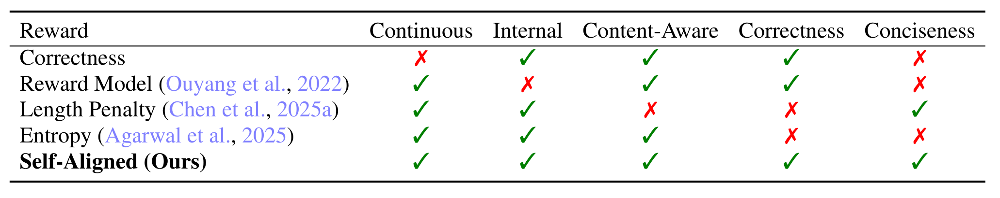
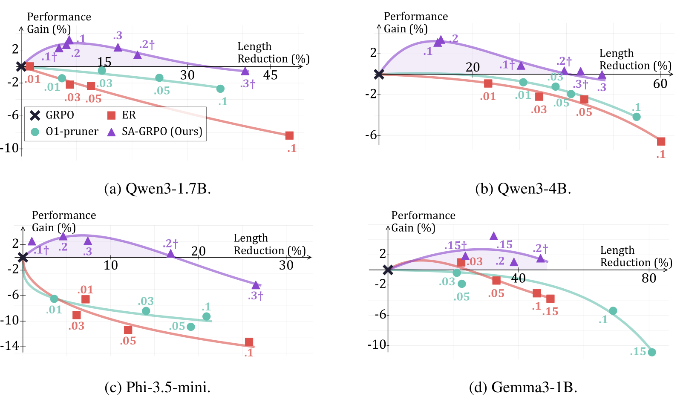

<div align="center">
<h2>
Self-aligned Reward: towards Effective and Efficient Reasoners
</h2>
</div>

<div align="center">
<h3>
Peixuan Han, Adit Krishnan, Gerald Friedland, Jiaxuan You, Chris Kong
</h3>
</div>
<p align="center">
  <a href="https://arxiv.org/pdf/2509.05489">
    
  </a>
</p>

## About SAR


Self-aligned reward (**SAR**) is a generic, universally applicable self-guided signal that complements verifiable rewards to enhance both reasoning accuracy and efficiency in RL. By utilizing the perplexity signals within the model, SAR encourages more compact, efficient reasoning paths while maintaining strong reasoning capacity.



Specifically, **SAR** compares the perpexity of a model rollout given and not given the question as context:

=R_{\text{VR}}&plus;\alpha&space;R_{\text{SA}},\quad&space;R_{\text{SA}}=\operatorname{clip}\!\left(\frac{\operatorname{ppl}(a_i)-\operatorname{ppl}(a_i\mid&space;q)}{\operatorname{ppl}(a_i)},-1,1\right)\end{equation})

$$
\begin{equation}
\small
\operatorname{ppl}(a)
=
e^{-\frac{1}{|a|}
\sum_{j=1}^{|a|}
\log P(a_j \mid a_{1\ldots j-1})},
\quad
\operatorname{ppl}(a \mid q)
=
e^{-\frac{1}{|a|}
\sum_{j=1}^{|a|}
\log P(a_j \mid q, a_{1\ldots j-1})}.
\end{equation}
$$

As a result, answers that are closely tailored to the question will receive a higher SAR score.


## Repo Usage

Our repository is based on verl 0.3.1.dev0.

### Setup

Run each step specified in `preconfig.sh` to prepare the environment. Please note a compatible environment with conda installed and available is required.

### Data Processing

`preconfig.sh` also contains the commands to prepare math datasets used in our paper.

`examples/data_preprocess` contains scripts for preparing datasets. One can customize their own datasets based on the code.

### Training

We provide two example scripts in `scripts/ppo.sh` and `scripts/grpo.sh`. Key hyperparameters are `reward_types` and `reward_factors`. We denote self-aligned reward as "ppl_qa" in the codebase. 

One can read `verl/trainer/config/ppo_trainer.yaml` to learn details for all hyperparameters.

Self-aligned reward can be seamlessly adapted to different RL algorithms.

### Evaluation

`scripts/batched_validate.sh` and `scripts/auto_validate.sh` are scripts for inference.

From the figure below, we can find that self-aligned reward leads to notable gains on both accuracy and efficiency.



## Cite this paper


If you find this repo or the paper useful, please cite:

```
@article{han2025self,
  title={Self-Aligned Reward: Towards Effective and Efficient Reasoners},
  author={Han, Peixuan and Krishnan, Adit and Friedland, Gerald and You, Jiaxuan and Kong, Chris},
  journal={arXiv preprint arXiv:2509.05489},
  year={2025}
}
```


Reach out to [Peixuan Han](mailto:ph16@illinois.edu) for any questions.
